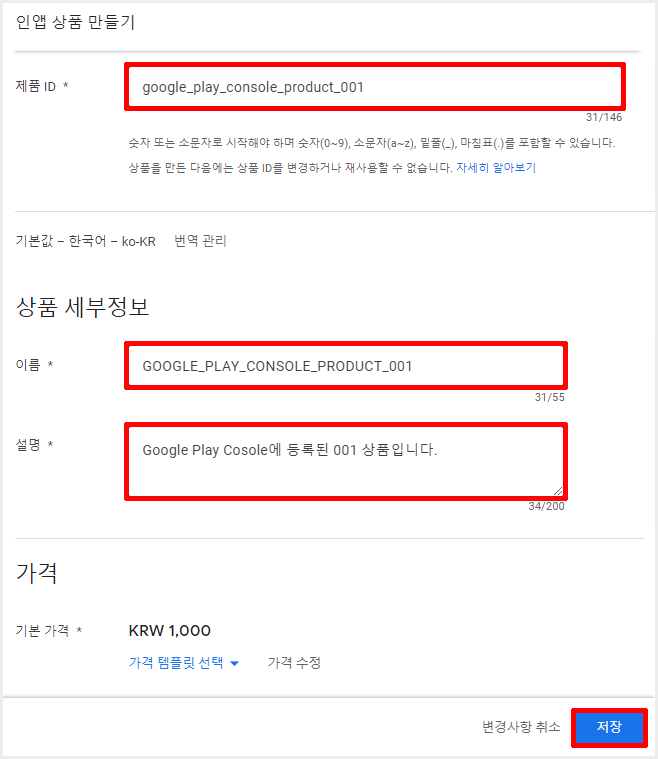

**************************
Google Play Console 설정
**************************

Google 인증 설정에 이어 결제를 위한 설정을 진행합니다.
    
Refresh Token 발급
=================================================

1. `Google Play Console <https://play.google.com/apps/publish>`_ 이동
2. **연결된 Google Cloud 프로젝트** 설정

  1. **Menu > 설정 > API 액세스**

    .. image:: _static/image/google_console_api_access_menu.png

  2. Click **연결할 프로젝트 선택**

    .. image:: _static/image/google_console_api_access_get_permission.png

  3. Click **동의**

    .. image:: _static/image/google_console_api_access_terms.png
  
  4. 기존 프로젝트 연결: 활성화
  5. Google Cloud 프로젝트: HandsOnLab
  6. Click **프로젝트 연결**

    .. image:: _static/image/google_console_api_access_connect_exist_project.png

3. **승인된 리디렉션 URI** 설정

  1. **연결된 Google Cloud 프로젝트**
  2. Click **프로젝트 보기**

    .. image:: _static/image/google_console_view_project.png

  3. **API 및 서비스 > 사용자 인증 정보**

    .. image:: _static/image/google_cloud_menu_auth_info.png

  4. Click **웹 클라이언트**

    .. image:: _static/image/google_cloud_auth_info_web_client.png

  5. Click **URI 추가**
  6. **https://developers.google.com/oauthplayground** 입력
  7. Click **저장**

    .. image:: _static/image/google_cloud_auth_info_add_uri.png

4. Refresh Token

  1. `OAuth 2.0 Playground <https://developers.google.com/oauthplayground/>`_ 이동
  2. Click **Settings**
  3. OAuth 2.0 configuration 설정
  
    1. Use your own OAuth credentials: 활성화
    2. OAuth Client ID: 웹 애플리케이션 클라이언트 ID
    3. OAuth Client secret: 웹 애플리케이션 클라이언트 보안 비밀번호
    4. **https://www.googleapis.com/auth/androidpublisher** 입력
  
  4. Click **Authorize APIs**

    .. image:: _static/image/google_playground_step1.png

  5. Click **Exchange authorization code for tokens**
  6. **Refresh Token** 확인

    .. image:: _static/image/google_playground_step2.png

  .. tip::
    * **Refresh Token** 은 다음 장 **NHN Cloud Console 설정** 에서 사용됩니다.

라이선스
===============================

1. `Google Play Console <https://play.google.com/apps/publish>`_ 이동
2. **Menu > 모든 앱**
3. Click **HandsOnLab**

  .. image:: _static/image/google_console_license_my_app.png

4. **Menu > 재무 보고서 > 수익 창출 설정**
5. 라이선스 확인

  .. image:: _static/image/google_console_license.png

  .. tip::
    * **Refresh Token** 은 다음 장 **NHN Cloud Console 설정** 에서 사용됩니다.

인앱 상품 만들기
===============================

.. tip:: 
  * Google Payments 판매자 계정을 설정하지 않으면 상품 등록이 되지 않습니다.
  * 앱을 출시하지 않으면 인앱 상품 등록이 되지 않습니다.
    
    * 앱 출시 후, 검토 기간은 1일 정도 소요되며, 이 기간동안 인앱 상품 등록은 되지만 결제는 진행되지 않습니다.
    * 앱 출시가 안 된 상태라면 `버전 준비 및 출시 가이드 <https://play.google.com/apps/publish>`_ 를 참고하여 앱을 출시하십시오.

1. **Menu > 수익 창출 > 제품 > 인앱 상품**

  .. image:: _static/image/google_console_menu_inapp_product.png

2. Click **상품 만들기**

  .. image:: _static/image/google_console_create_product.png

3. 인앱 상품 정보 입력

  * 제품 ID : google_play_console_product_001 (NHN Cloud Console에서 상품 등록 시 사용)
  * 이름 : GOOGLE_PLAY_CONSOLE_PRODUCT_001
  * 설명 : Google Play Cosole에 등록된 001 상품입니다.
  * 가격 : 1,000

4. Click **저장**
5. Click **활성화**

라이선스 테스터 등록
===============================

1. `Google Play Console <https://play.google.com/apps/publish>`_ 이동
2. **Menu 설정 > 라이선스 테스트**

  .. image:: _static/image/google_console_menu_license_test.png

3. 라이선스 테스터 추가: Google 계정과 연결되어 있는 이메일 주소 추가(개발자 본인의 계정은 항상 라이선스가 부여된 테스터로 간주됩니다.)

  .. image:: _static/image/google_console_license_test.png