**************************
Google Play Console 설정
**************************

Google 인증 설정에 이어 결제를 위한 설정을 진행합니다.
    
Refresh Token 발급
=================================================

1. `Google Play Console <https://play.google.com/apps/publish>`_ 로 이동합니다.
2. 좌측 사이드 메뉴에서 설정 > 개발자 계정 > API 액세스 메뉴를 선택합니다.
3. **연결된 Google Cloud 프로젝트** 에서 프로젝트 보기 버튼을 클릭합니다.

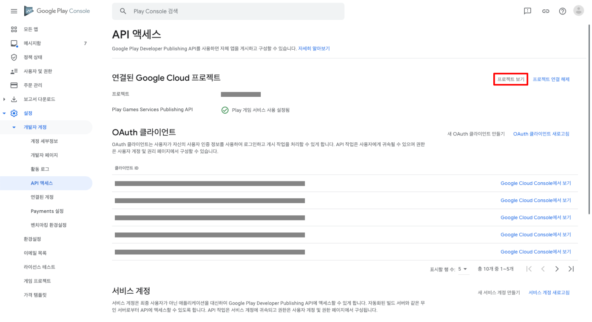

4. Google Cloud 프로젝트의 좌측 사이드 메뉴에서 사용자 인증 정보 메뉴를 선택 후, OAuth 2.0 클라이언트 ID의 **웹 애플리케이션** 클라이언트 ID를 클릭합니다.

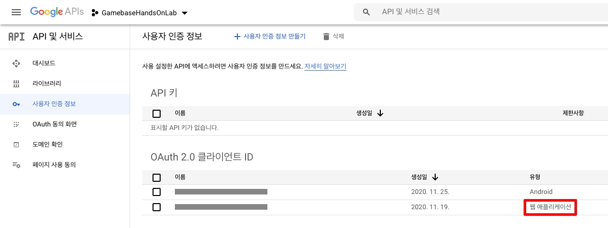

5. 승인된 리디렉션 URI에 **https://developers.google.com/oauthplayground/** 를 추가 후, 저장합니다.

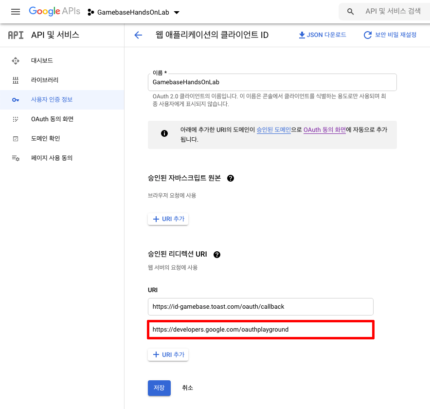

6. `OAuth 2.0 Playground <https://developers.google.com/oauthplayground/>`_ 를 오픈합니다. 
7. OAuth 2.0 Configuration 버튼을 클릭 후, **웹 애플리케이션** 클라이언트 ID에 등록된 **Client ID** 와 **Client Secret** 을 입력합니다.
8. Step1의 입력 창에 **https://www.googleapis.com/auth/androidpublisher** 입력하고, Authorize APIs 버튼을 클릭하여 Authorization code 코드를 발급받습니다.

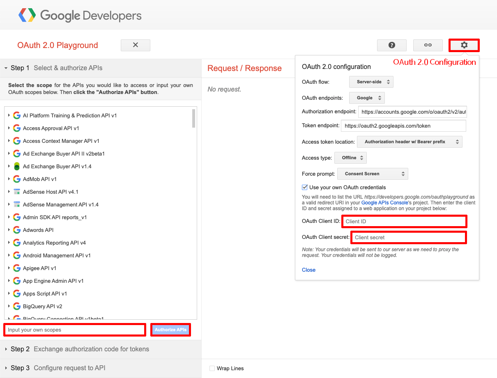

9. Step2 탭을 열고, Exchange authorization code for tokens 버튼을 클릭하여 **Refresh Token** 을 발급받습니다. (Gamebase Console에서 스토어 등록 시 사용됩니다.)

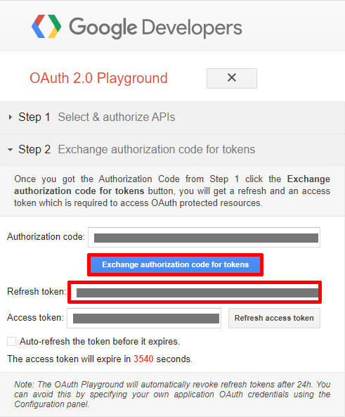

라이선스
===============================

1. `Google Play Console <https://play.google.com/apps/publish>`_ 로 이동합니다.
2. 좌측 사이드 메뉴에서 모든 앱 메뉴를 선택 후, 앱 목록에서 내가 만든 앱을 선택합니다.
3. 좌측 사이드 메뉴에서 수익 창출 > 수익 창출 설정 메뉴를 선택합니다.
4. **라이선스** 를 확인합니다. (Gamebase Console에서 스토어 등록 시 사용됩니다.)

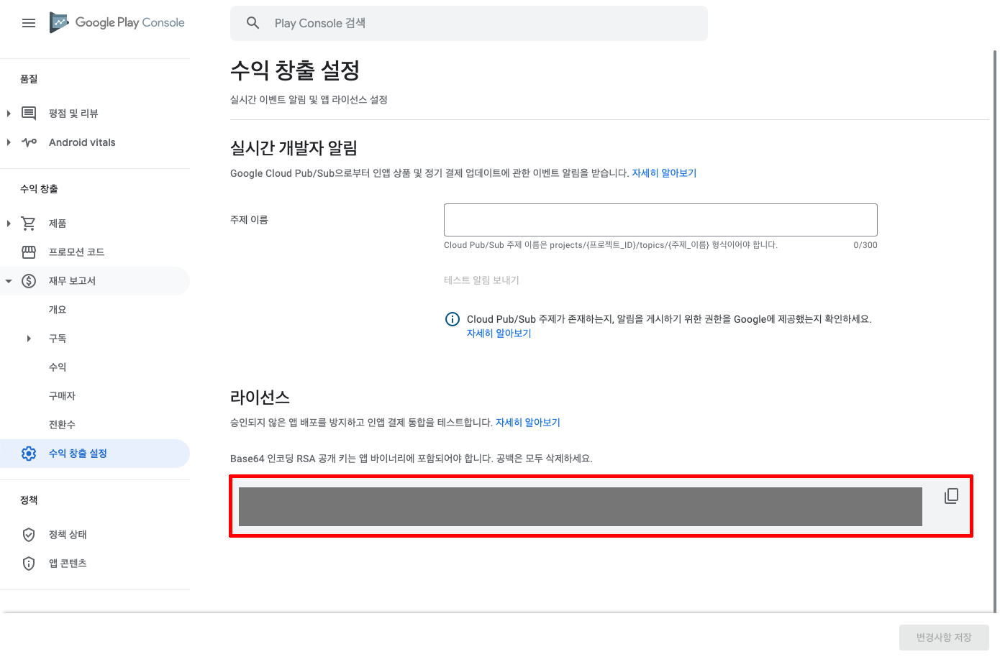

Google Play Android Developer API
=====================================

1. Google Play Console의 좌측 사이드 메뉴에서 성장 > Play 게임 서비스 > 설정 및 관리 > 설정 메뉴 선택 후, Google Cloud Platform에서 보기 버튼을 클릭합니다.

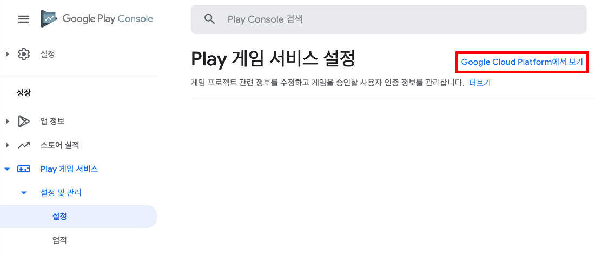
    
2. Google Cloud 프로젝트에서 + API 서비스 사용 설정 버튼을 클릭합니다.

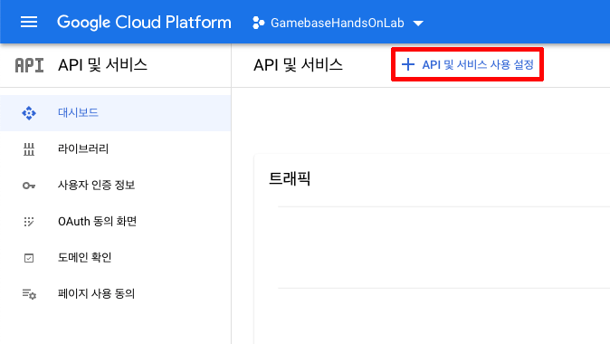

5. **Google Play Android Developer API** 를 검색하여 등록합니다.

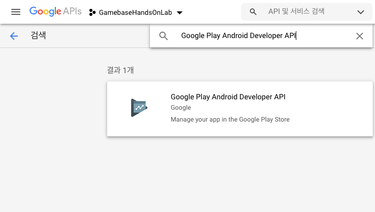

인앱 상품 만들기
===============================

.. tip:: 
    - 앱을 출시하지 않으면 인앱 상품 등록이 되지 않습니다.
    - 앱 출시 후, 검토 기간은 1일 정도 소요되며, 이 기간동안 인앱 상품 등록은 되지만 결제는 진행되지 않습니다.
    - 앱 출시가 안 된 상태라면 `버전 준비 및 출시 가이드 <https://play.google.com/apps/publish>`_ 를 참고하여 앱을 출시하십시오.

1. 좌측 사이드 메뉴에서 수익 창출 > 제품 > 인앱 상품 메뉴를 선택 후, 상품 만들기 버튼을 클릭합니다.

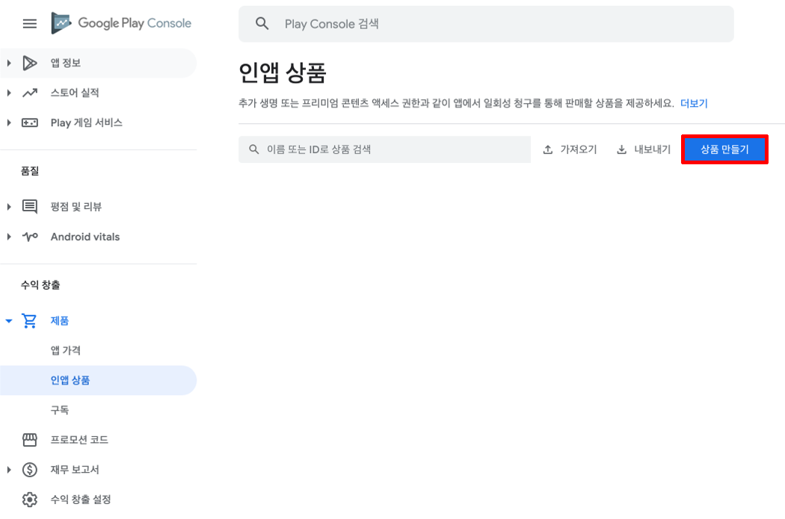

2. 인앱 상품의 정보를 기입 후, 저장 버튼을 클릭합니다.

- 제품 ID : 제품의 ID입니다. (Gamebase Console에서 상품 등록 시 사용됩니다.)
- 이름 : 상품 구매 시 구글 결제 창에 노출되는 상품의 이름입니다.
- 설명 : 상품의 설명입니다.
- 가격 : 가격 수정 버튼을 눌러 가격을 적용합니다.

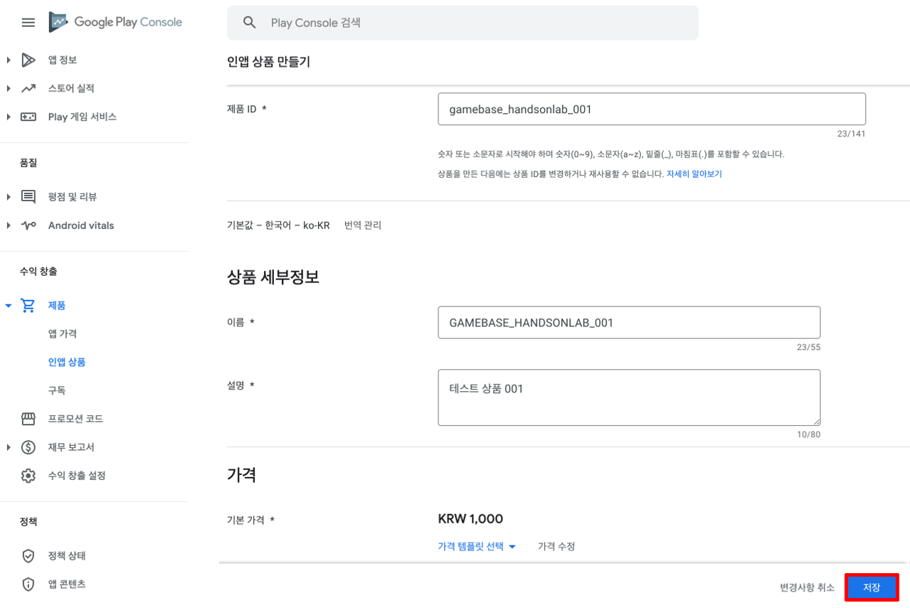

3. 상품이 등록되었는지 확인합니다.

라이선스 테스터 등록
===============================

1. `Google Play Console <https://play.google.com/apps/publish>`_ 로 이동합니다.
2. 좌측 사이드 메뉴에서 설정 > 라이선스 테스트 메뉴를 선택합니다.
3. 라이선스 테스터에 Google 계정과 연결되어 있는 이메일 주소를 추가합니다. (개발자 본인의 계정은 항상 라이선스가 부여된 테스터로 간주됩니다.)

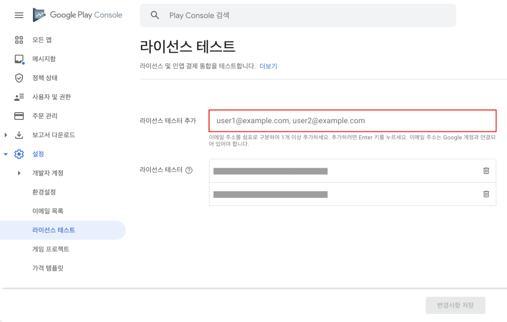