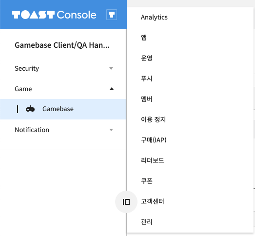
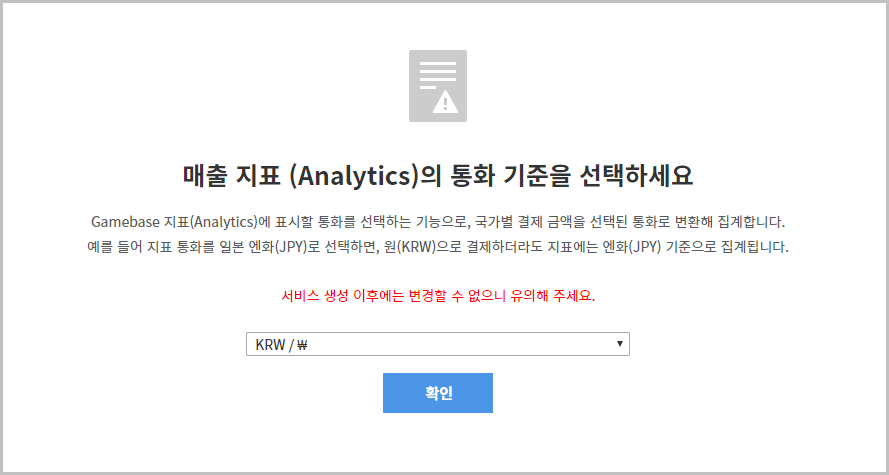
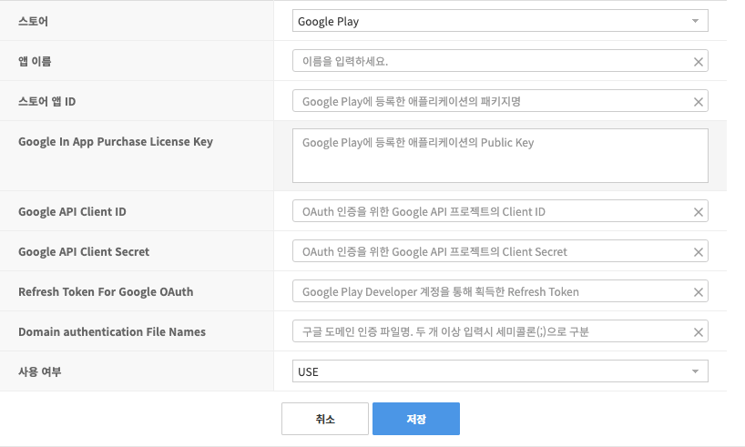
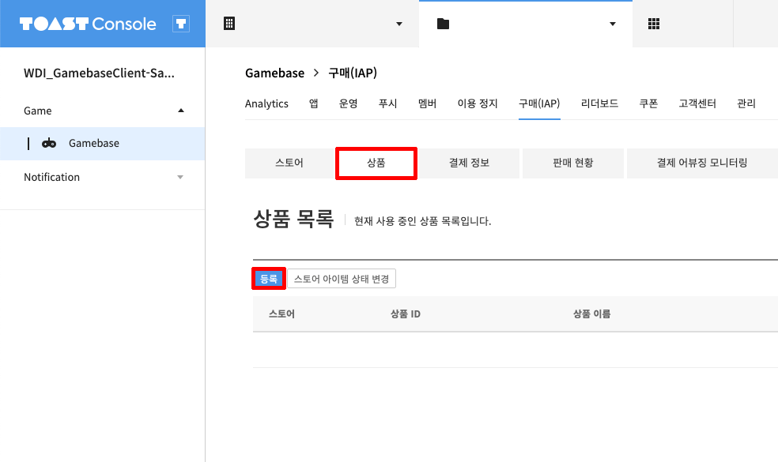
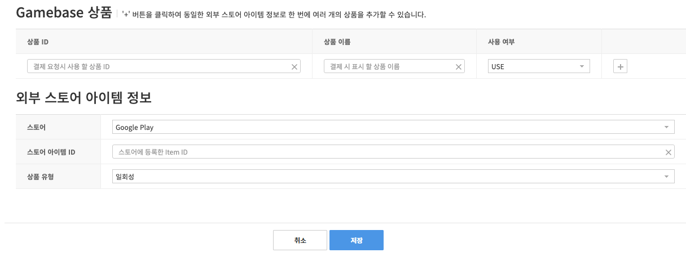

**********************
Gamebase Console 설정
**********************

Gamebase Console에 Google Play 스토어 정보와 상품을 등록하는 방법을 설명합니다.

스토어 등록
===============================

1. `TOAST Console <https://console.toast.com/>`_ 로 이동합니다.
2. 좌측 사이드 메뉴에서 Game > Gamebase > 구매(IAP) 메뉴를 선택합니다.

3. 매출 지표(Analytics)의 통화 기준을 선택합니다. 최초 한 번만 설정 가능하며 Analytics 매출 지표에는 설정된 통화 코드로 지표가 노출됩니다.

4. 스토어 탭에서 등록 버튼을 클릭하여 스토어를 등록합니다.

.. image:: _static/image/toast_console_003.png

5. 스토어 정보를 입력합니다.

.. tip:: 
    - Google API Client ID, Google API Client Secret, Refresh Token For Google OAuth 설정은 **연결된 프로젝트** 의 정보를 기입해야 합니다.
    - `Google Play Console <https://play.google.com/apps/publish>`_ 로 이동합니다.
    - 좌측 사이드 메뉴에서 설정 > 개발자 계정 > API 액세스 메뉴를 선택합니다.
    - 연결된 Google Cloud 프로젝트에서 프로젝트 보기 버튼을 클릭합니다.

    .. image:: _static/image/google_console_001.png

- 스토어 : Google Play를 선택합니다.
- 앱 이름 : 앱 이름을 입력합니다.
- 스토어 앱 ID : 스토어 앱 ID를 입력합니다. (Unity Package Name)
- Google In App Purchase License Key : Google Play Console 설정에서 확인했었던 라이선스를 기입합니다.
- Google API Client ID : 연결된 Google Cloud 프로젝트 > 사용자 인증 정보 > 웹 애플리케이션 > Client ID
- Google API Client Secret : 연결된 Google Cloud 프로젝트 > 사용자 인증 정보 > 웹 애플리케이션 > Client Secret
- Refresh Token For Google OAuth : OAuth 2.0 Pluyground에서 발급받은 Refresh Token
- Domain authentication File Names : 구독 상품 사용 시 설정
- 사용 여부 : USE

상품 등록
===============================

1. 상품 탭을 선택 후, 등록 버튼을 클릭합니다.

2. 상품 정보를 입력합니다.

- 상품 ID : Gamebase Purchase에 사용되는 상품 ID입니다. (gamebaseProductId)
- 상품 이름 : 상품 구매 시 게임의 구매 창에 노출할 상품 이름입니다.
- 사용 여부 : USE를 선택하여 상품을 활성화합니다.
- 스토어 : Google Play를 선택합니다.
- 스토어 아이템 ID : Google Play Store에 등록한 인앱 상품의 제품 ID입니다.
- 상품 유형 : 일회성을 선택합니다.

3. 상품이 등록되었는지 확인합니다.