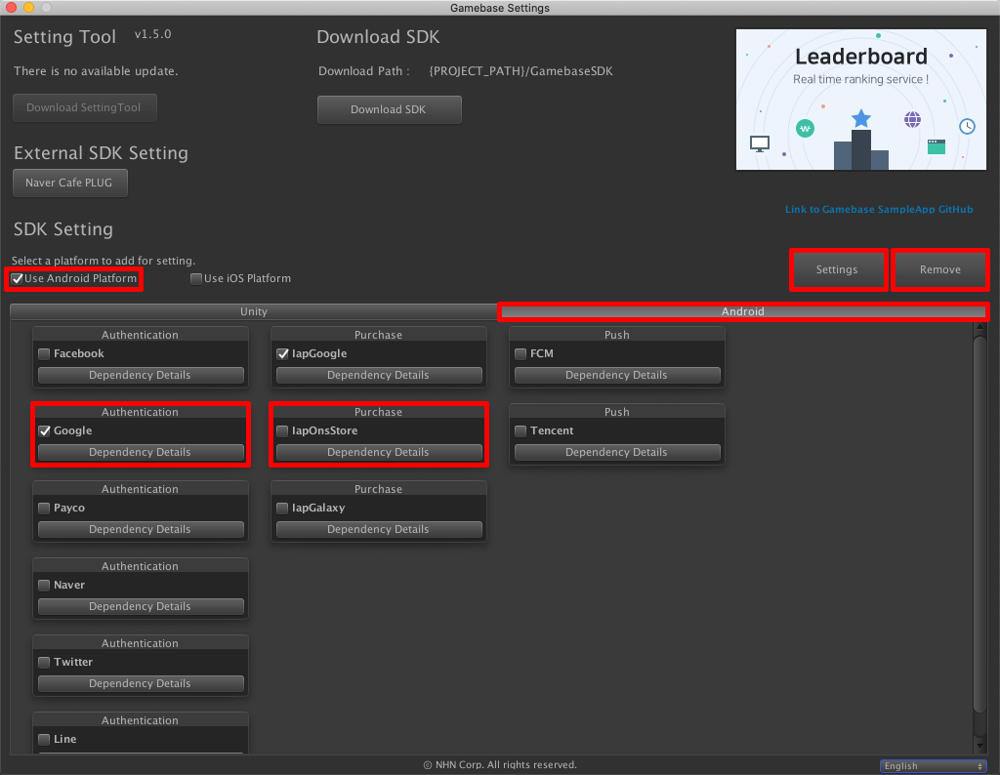

**********************
Gamebase SDK 설치
**********************

1. 이전 토픽에서 설치한 Gamebase SDK를 Setting Tool의 Remove 버튼을 클릭하여 제거합니다.
2. 아래 내용을 참고하여 Gamebase SDK를 설치합니다.

플랫폼 선택
===============================

Android만 선택합니다.

모듈 선택
===============================

Android 탭 > Google 모듈과 Iap 모듈을 선택합니다.

설치
===============================

플랫폼과 모듈을 선택했으면 Gamebase SDK를 설치합니다.

* **Settings** 클릭

