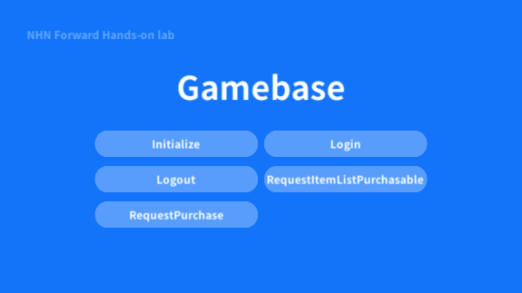

**********************
Unity에서 결제하기
**********************

UI 추가
===============================

1. Hierarchy에서 HandsOnLabSample 선택
2. ButtonList 수정

  * Size: 5
  * Element 3: RequestItemListPurchasable
  * Element 4: RequestPurchase

  .. image:: _static/image/unity_inspector.png

코드 구현
===============================

Assets/TOAST/Codelab/Gamebase/Scripts/HandsOnLab/UserImplementation.cs 파일에 아래 코드 추가

.. code-block:: C#

    public static void RequestItemListPurchasable()
    {
        Gamebase.Purchase.RequestItemListPurchasable((purchasableItemList, error) =>
        {
            if (Gamebase.IsSuccess(error) == true)
            {
                SampleLogger.Log("RequestItemListPurchasable succeeded.");

                foreach (GamebaseResponse.Purchase.PurchasableItem purchasableItem in purchasableItemList)
                {
                    var message = new StringBuilder();
                    message.AppendLine(string.Format("gamebaseProductId:{0}", purchasableItem.gamebaseProductId));
                    message.AppendLine(string.Format("itemSeq:{0}", purchasableItem.itemSeq));
                    message.AppendLine(string.Format("price:{0}", purchasableItem.price));
                    message.AppendLine(string.Format("currency:{0}", purchasableItem.currency));
                    message.AppendLine(string.Format("itemName:{0}", purchasableItem.itemName));
                    message.AppendLine(string.Format("marketItemId:{0}", purchasableItem.marketItemId));
                    message.AppendLine(string.Format("productType:{0}", purchasableItem.productType));
                    message.AppendLine(string.Format("localizedPrice:{0}", purchasableItem.localizedPrice));
                    message.AppendLine(string.Format("isActive:{0}", purchasableItem.isActive));
                    Debug.Log(message);
                }
            }
            else
            {
                SampleLogger.Log(string.Format("RequestItemListPurchasable failed. error is {0}", error));
            }
        });
    }

    public static void RequestPurchase()
    {
        var gamebaseProductId = "nhn_cloud_console_product_001";
        Gamebase.Purchase.RequestPurchase(gamebaseProductId, (purchasableReceipt, error) =>
        {
            if (Gamebase.IsSuccess(error) == true)
            {
                SampleLogger.Log("RequestPurchase succeeded");

                var message = new StringBuilder();
                message.AppendLine(string.Format("gamebaseProductId:{0}", purchasableReceipt.gamebaseProductId));
                message.AppendLine(string.Format("itemSeq:{0}", purchasableReceipt.itemSeq));
                message.AppendLine(string.Format("price:{0}", purchasableReceipt.price));
                message.AppendLine(string.Format("currency:{0}", purchasableReceipt.currency));
                message.AppendLine(string.Format("paymentSeq:{0}", purchasableReceipt.paymentSeq));
                message.AppendLine(string.Format("purchaseToken:{0}", purchasableReceipt.purchaseToken));
                message.AppendLine(string.Format("marketItemId:{0}", purchasableReceipt.marketItemId));
                message.AppendLine(string.Format("productType:{0}", purchasableReceipt.productType));
                message.AppendLine(string.Format("userId:{0}", purchasableReceipt.userId));
                message.AppendLine(string.Format("paymentId:{0}", purchasableReceipt.paymentId));
                message.AppendLine(string.Format("originalPaymentId:{0}", purchasableReceipt.originalPaymentId));
                message.AppendLine(string.Format("purchaseTime:{0}", purchasableReceipt.purchaseTime));
                message.AppendLine(string.Format("expiryTime:{0}", purchasableReceipt.expiryTime));
                message.AppendLine(string.Format("payload:{0}", purchasableReceipt.payload));
                Debug.Log(message);
            }
            else
            {
                SampleLogger.Log(string.Format("RequestPurchase failed. error is {0}", error));
            }
        });
    }

Build & Run
===============================

**Menu > File > Save Project**

1. Android 디바이스 연결
2. **Menu > File > Build & Run**

  .. image:: _static/image/unity_build_and_run.png

3. APK 파일 이름: gamebase-handsonlab.apk
4. 디바이스에서 실행 확인
5. Click **Initialize**
6. Click **Login**
7. Click **RequestItemListPurchasable**
8. Click **RequestPurchase**

Troubleshooting
===============================

결제 중 오류가 발생할 경우 다음 문서를 참고하시기 바랍니다.

`Error Handling <https://docs.toast.com/ko/Game/Gamebase/ko/unity-purchase/#error-handling>`_ 