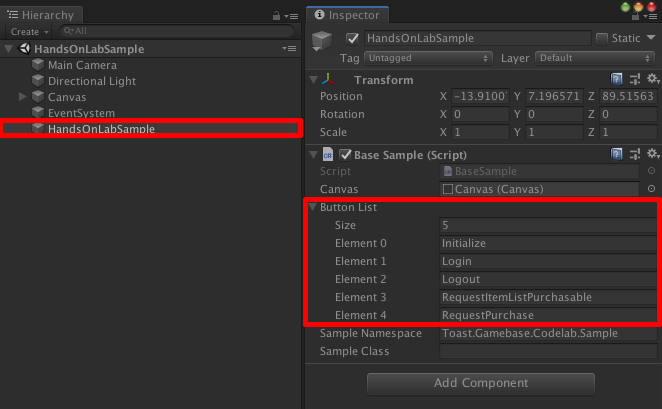

**********************
Unity에서 결제하기
**********************

UI 추가
===============================

Google 인증을 위한 Google Play 및 TOAST Console 설정 토픽까지 잘 진행하신 분들이라면 Unity 실행 시, Initialize, Login, Logout 버튼이 존재할 것입니다.
이번 토픽에서는 Gamebase의 결제 API 중에서 RequestItemListPurchasable, RequestPurchase API를 구현할 것이므로 2개의 버튼을 추가하도록 하겠습니다.

1. Hierarchy Window에서 HandsOnLabSample을 선택합니다.
2. Inspetor Window에서 ButtonList의 Size를 5로 변경하고 Element 3은 RequestItemListPurchasable, Element 4는 RequestPurchase를 입력합니다.

코드 구현
===============================

Assets/TOAST/Codelab/Gamebase/Scripts/HandsOnLab/UserImplementation.cs 파일 오픈 후, 아래 Class Method를 추가합니다.

.. code-block:: C#

    public static void RequestItemListPurchasable()
    {
        Gamebase.Purchase.RequestItemListPurchasable((purchasableItemList, error) =>
        {
            if (Gamebase.IsSuccess(error) == true)
            {
                SampleLogger.Log("RequestItemListPurchasable succeeded.");

                foreach (GamebaseResponse.Purchase.PurchasableItem purchasableItem in purchasableItemList)
                {
                    var message = new StringBuilder();
                    message.AppendLine(string.Format("gamebaseProductId:{0}", purchasableItem.gamebaseProductId));
                    message.AppendLine(string.Format("itemSeq:{0}", purchasableItem.itemSeq));
                    message.AppendLine(string.Format("price:{0}", purchasableItem.price));
                    message.AppendLine(string.Format("currency:{0}", purchasableItem.currency));
                    message.AppendLine(string.Format("itemName:{0}", purchasableItem.itemName));
                    message.AppendLine(string.Format("marketItemId:{0}", purchasableItem.marketItemId));
                    message.AppendLine(string.Format("productType:{0}", purchasableItem.productType));
                    message.AppendLine(string.Format("localizedPrice:{0}", purchasableItem.localizedPrice));
                    message.AppendLine(string.Format("isActive:{0}", purchasableItem.isActive));
                    Debug.Log(message);
                }
            }
            else
            {
                SampleLogger.Log(string.Format("RequestItemListPurchasable failed. error is {0}", error));
            }
        });
    }

    public static void RequestPurchase()
    {
        var gamebaseProductId = "gamebase_handsonlab_001";
        Gamebase.Purchase.RequestPurchase(gamebaseProductId, (purchasableReceipt, error) =>
        {
            if (Gamebase.IsSuccess(error) == true)
            {
                SampleLogger.Log("RequestPurchase succeeded");

                var message = new StringBuilder();
                message.AppendLine(string.Format("gamebaseProductId:{0}", purchasableReceipt.gamebaseProductId));
                message.AppendLine(string.Format("itemSeq:{0}", purchasableReceipt.itemSeq));
                message.AppendLine(string.Format("price:{0}", purchasableReceipt.price));
                message.AppendLine(string.Format("currency:{0}", purchasableReceipt.currency));
                message.AppendLine(string.Format("paymentSeq:{0}", purchasableReceipt.paymentSeq));
                message.AppendLine(string.Format("purchaseToken:{0}", purchasableReceipt.purchaseToken));
                message.AppendLine(string.Format("marketItemId:{0}", purchasableReceipt.marketItemId));
                message.AppendLine(string.Format("productType:{0}", purchasableReceipt.productType));
                message.AppendLine(string.Format("userId:{0}", purchasableReceipt.userId));
                message.AppendLine(string.Format("paymentId:{0}", purchasableReceipt.paymentId));
                message.AppendLine(string.Format("originalPaymentId:{0}", purchasableReceipt.originalPaymentId));
                message.AppendLine(string.Format("purchaseTime:{0}", purchasableReceipt.purchaseTime));
                message.AppendLine(string.Format("expiryTime:{0}", purchasableReceipt.expiryTime));
                message.AppendLine(string.Format("payload:{0}", purchasableReceipt.payload));
                Debug.Log(message);
            }
            else
            {
                SampleLogger.Log(string.Format("RequestPurchase failed. error is {0}", error));
            }
        });
    }

Build & Run
===============================

Menu > File > Save Project

1. Android 디바이스 연결
2. **Menu > File > Build & Run**
3. APK 파일 이름 지정 팝업이 뜰 경우 **gamebase-handsonlab.apk** 로 설정
4. 디바이스에서 실행 확인
5. **Initialize** 버튼 클릭 후, Initialize 성공 확인
6. **Login** 버튼 클릭 후, 로그인 성공 확인
7. **RequestItemListPurchasable** 버튼 클릭 후, RequestItemListPurchasable 성공 확인
8. **RequestPurchase** 버튼 클릭 후, RequestPurchase 성공 확인

.. image:: _static/image/unity_game_scene.png

Troubleshooting
===============================

Login 중 오류가 발생할 경우 다음 문서를 참고하시기 바랍니다.

`Error Handling <https://docs.toast.com/ko/Game/Gamebase/ko/unity-purchase/#error-handling>`_ 